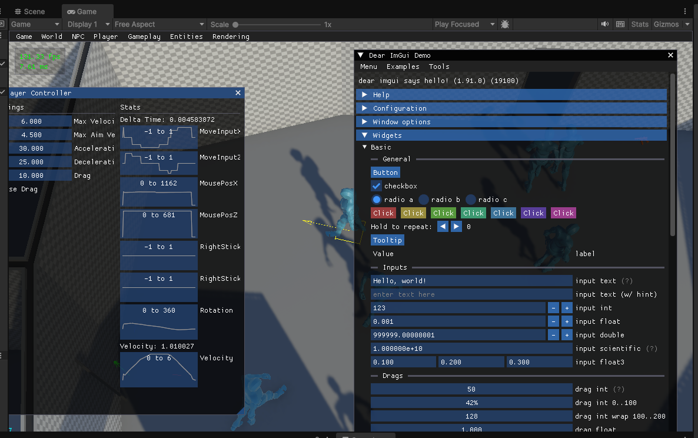

# Kowloon Dear ImGui

Implementation of Dear ImGui for Unity 6 ECS

## Notes for Scene View support in Editor:

Currently, we are not triggering scene view redraws manually, which is why we need to make sure the scene view always updates. 

- Edit > Preferences > General **"Interaction Mode"** needs to be set to **"No Throttling"**.
- **"Always Refresh"** in the Scene View must be enabled.

If this is not enabled inputs won't register correctly in the editor scene view. The game view in editor is not affected by this.

## Known Issues:
- This package is still fairly untested outside the main Kowloon game project and some issues might still need addressing.
- Editor gizmos render on top of ImGui windows. This is hardcoded in the Universal Render Pipeline. We would need to modify the URP package to allow for rendering after the editor draws
- UI Toolkit elements are also drawing after ImGui. Either the native package needs to modified or we render the UI to a texture first.
- Any ImGui calls can't be executed from Burst compiled code.

## Third-Party Licenses

This project makes use of the following projects all licensed under the MIT license:

- [Dear ImGui](https://github.com/ocornut/imgui)
- [cimgui](https://github.com/cimgui/cimgui)
- [ImGui.NET](https://github.com/ImGuiNET/ImGui.NET)

Additionally, the `DearImGuiUtils.UpdateMesh()` functionality is adapted from [UImgui](https://github.com/psydack/uimgui) also released under the MIT license.

For more information check Licenses directory.